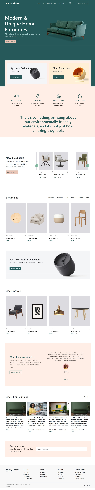
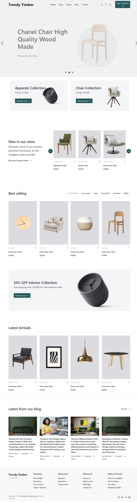
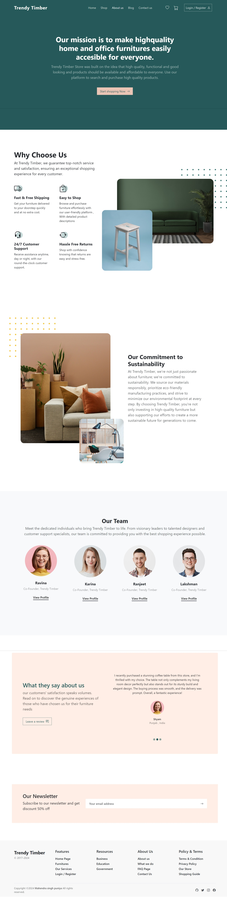
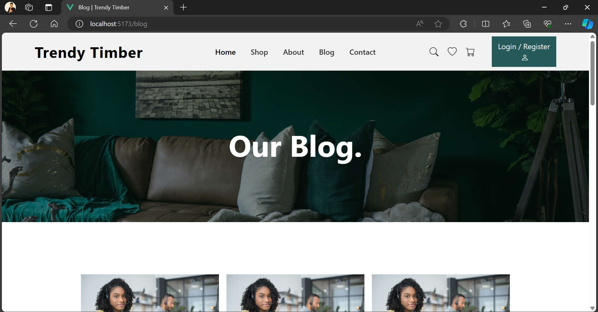
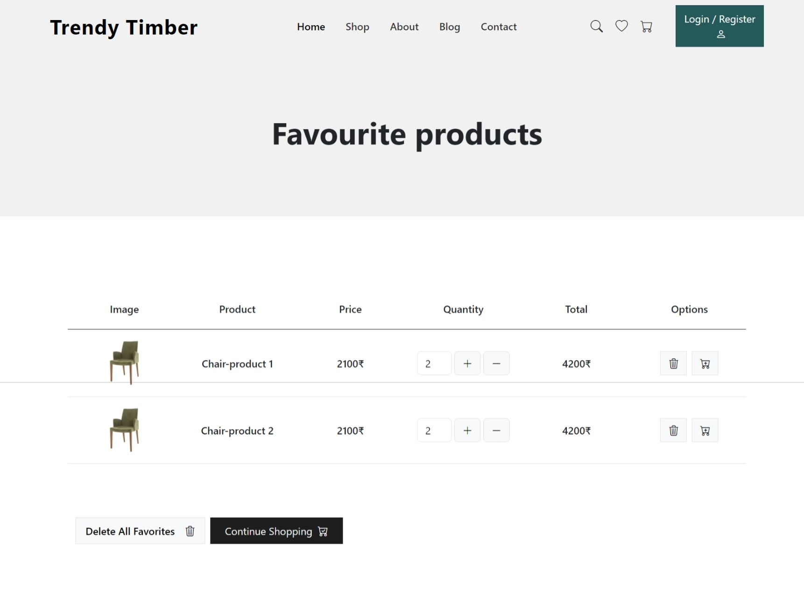
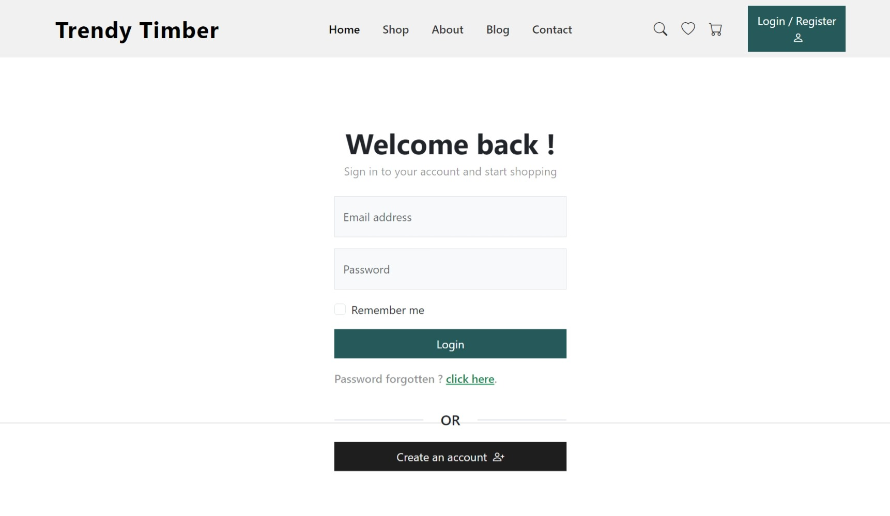
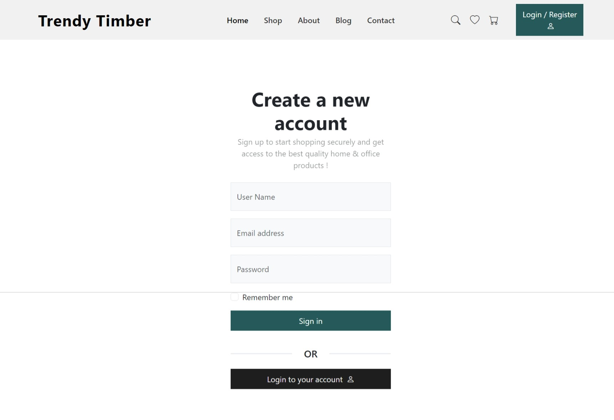
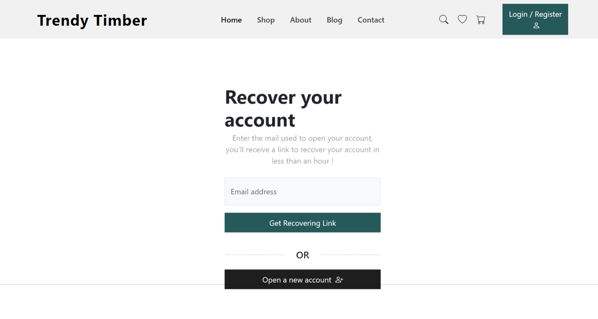
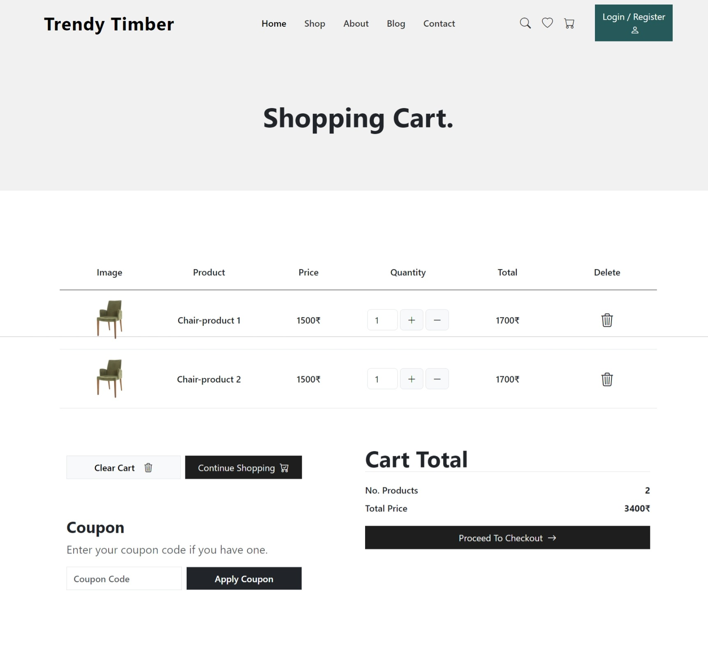

# **The Furniture E-Commerce Website**

**The Furniture** is an open-source home furniture e-commerce web app built with **Vue.js**.

**Website :** visit [https://truongkhanh23.vercel.app/](www.mahendra-pooniya.netlify.app/)

## **Overview**


**The Furniture** aims to provide a seamless and user-friendly experience for browsing and purchasing home furniture. The project focuses on creating a secure platform for users to discover, explore, and shop for high-quality home and office furnishings and decorations.

## **Tech Stack**

- **Node.js:**
- **Vue.js:**
- **HTML:**
- **CSS:**
- **JavaScript:**
- **Bootstrap:**

## **Features**

- **Intuitive UI:** Clean and user-friendly interface for a pleasant shopping experience.
- **Responsive Design:** Accessible and functional across various devices and screen sizes.
- **Vue.js:** Built with **Vue.js** for a modular and efficient frontend.


## **Installation**

Follow these steps to set up **The Furniture** locally:

### Prerequisites

- Node.js: Make sure you have Node.js installed on your machine.

### Steps

1. Clone the repository:

   ```bash
   git clone https://github.com/mahendra2811/Trendy-Timber-E-commerce.git
   ```

2. Navigate to the project directory:

   ```bash
   cd Trendy-Timber-E-commerce
   ```

3. Install dependencies:

   ```bash
   npm install
   ```

4. Run the development server:

   ```bash
   npm run dev
   ```

5. Open your browser and visit [http://localhost:PORT](http://localhost:PORT)

## **Further Improvements**

- Implement a secure authentication system for user accounts.
- Integrate a robust backend for data storage and management.
- Implement funtionalities for Add to cart/Add to Favorites
- Enhance the user interface with additional features and animations.
- Explore internationalization (i18n) for multi-language support.

## **Contributing**

Contributions are welcomed, for further modifications, improvements, or any questions, feel free to reach out to me via -

- **Email:** [truongnguyenkhanh230800@gmail.com](mailto:mahendrapuniya92@gmail.com)
- **Portfolio:** [www.truongkhanh23.com](https://truongkhanh23.vercel.app/)
- **Git-hub:** [www.github.com/TruongKhanh23](https://github.com/TruongKhanh23)

## **Screenshots **

Check out some captures of the web app in action !



**Shop Page:**



**About Page:**


**Blog Page:**



**Favourite Product Page:**



**Login Page:**



**Sign-up Page:**


**Forget Password Page:**



**Shoping cart  Page:**




